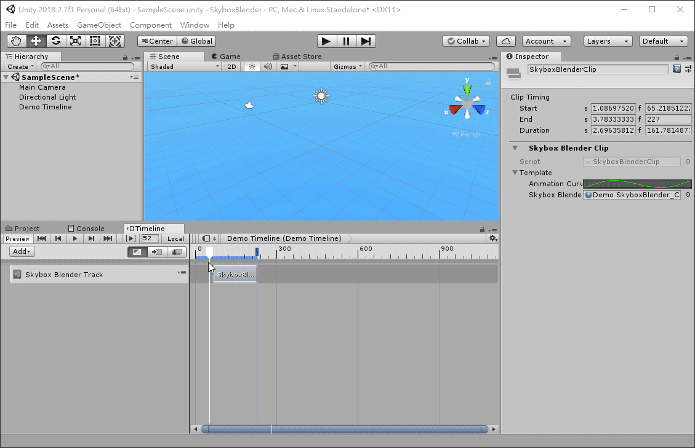
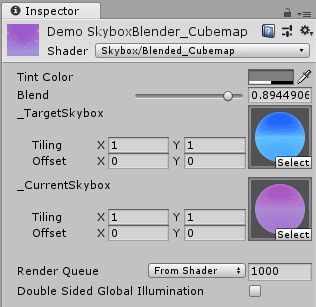

# Skybox Blender

Provide a simple timeline track to transit two skybox.

Must use the material with **Skybox/Blended_Cubemap** or **Skybox/Blended_6side** shader .

The skybox texture is download from AssetStore：[FREE Skybox - Cubemap Extended](https://assetstore.unity.com/packages/vfx/shaders/free-skybox-cubemap-extended-107400).
